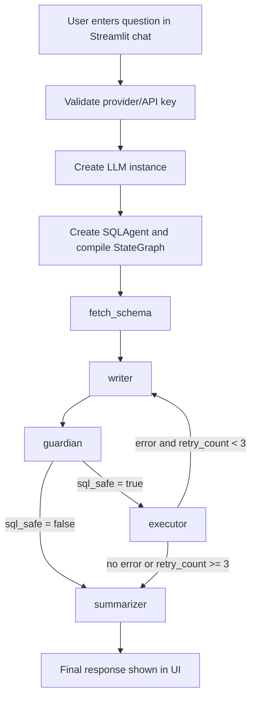

# Natural Language to SQL Data Analyst Agent

This project is a Streamlit application backed by a LangGraph workflow that translates a user question into SQL, executes the SQL on a local SQLite database, and returns an LLM-generated natural-language answer.

## 1) Project Overview

### What the system does
- Accepts natural-language questions through a chat UI.
- Builds SQL using an LLM with schema context.
- Runs a security gate before execution.
- Executes SQL against `company.db`.
- Summarizes database output (or errors) using the same LLM.

### Key capabilities (implemented)
- Multi-provider LLM selection in the UI (`Ollama`, `Gemini`, `OpenAI`, `Anthropic`).
- Provider model discovery via SDK calls (`ollama.list`, `OpenAI.models.list`, `google.generativeai.list_models`, curated Anthropic list).
- Stateful LangGraph execution with retry loop (`retry_count < 3`).
- Automatic SQLite bootstrap and seed data creation.

### Problem it solves
- Converts ad-hoc user questions into executable SQL and readable answers for a small relational dataset without requiring users to write SQL manually.

## 2) Architecture Overview

### Components
- **UI layer (`app.py`)**
   - Streamlit sidebar configuration (provider, API key, model selection).
   - Chat input/history rendering.
   - Live status output per workflow node.
- **Backend logic (`backend.py`)**
   - SQLite setup (`setup_db`).
   - `SQLAgent` methods for schema fetch, SQL generation, query safety check, SQL execution, and summarization.
- **Workflow system (`LangGraph`)**
   - `StateGraph(AgentState)` with five nodes:
      - `fetch_schema`
      - `writer`
      - `guardian`
      - `executor`
      - `summarizer`
   - Conditional routing after `guardian` and `executor`.

## 3) System Flow

### Step-by-step execution
1. User submits a question in Streamlit chat.
2. App validates API key requirement (non-Ollama providers).
3. App builds an LLM instance from selected provider/model.
4. App creates `SQLAgent(llm)` and compiles workflow.
5. Workflow enters `fetch_schema`.
6. `writer` generates SQL from schema + question (+ prior error, if any).
7. `guardian` checks SQL for forbidden keywords.
8. If safe, `executor` runs SQL and returns rows or SQL error.
9. If execution error and `retry_count < 3`, route back to `writer`.
10. `summarizer` generates final natural-language answer from question, SQL, data, and error context.
11. App displays final response and appends it to chat history.



## 4) Workflow / Agent Logic

### Node behavior
- `fetch_schema(state)`
   - Reads table names from `sqlite_master`.
   - Reads table columns using `PRAGMA table_info(<table>)`.
   - Returns `{"schema": schema_str}`.
- `write_sql(state)`
   - Prompts LLM with schema, question, and previous error.
   - Strips markdown fences from output.
   - Returns `{"sql_query": sql, "retry_count": state.get("retry_count", 0) + 1}`.
- `check_security(state)`
   - Uppercases query.
   - Blocks if regex word-boundary match hits one of: `DROP`, `DELETE`, `TRUNCATE`, `INSERT`, `UPDATE`, `ALTER`.
   - Returns either:
      - `{"sql_safe": False, "error": "..."}` or
      - `{"sql_safe": True, "error": ""}`.
- `execute_sql(state)`
   - Executes SQL via `sqlite3`.
   - Returns:
      - `{"result": str(rows), "error": ""}` for non-empty rows,
      - `{"result": "No data found.", "error": ""}` for empty rows,
      - `{"result": "", "error": str(e)}` on `sqlite3.Error`.
- `summarize_result(state)`
   - Prompts LLM with question, SQL, data, and error.
   - Returns `{"result": response.content}`.

### Routing logic
- After `guardian`:
   - `sql_safe == True` → `executor`
   - `sql_safe == False` → `summarizer`
- After `executor`:
   - `state["error"]` truthy and `state["retry_count"] < 3` → `writer`
   - otherwise → `summarizer`

## 5) Data Model / State Structure

`AgentState` is a `TypedDict` in `backend.py`.

| Key | Type | Purpose |
|---|---|---|
| `question` | `str` | Original user question |
| `schema` | `str` | Schema text passed to SQL writer |
| `sql_query` | `str` | Current SQL candidate |
| `sql_safe` | `bool` | Security gate decision |
| `result` | `str` | SQL output or final summarized answer |
| `error` | `str` | Security/execution error text |
| `retry_count` | `int` | SQL rewrite attempt count |

## 6) Core Modules Breakdown

### Backend module (`backend.py`)

| Function | Inputs | Output | Behavior |
|---|---|---|---|
| `setup_db()` | None | None | Creates `departments` and `employees`, inserts seed rows with `INSERT OR IGNORE` |
| `SQLAgent.__init__(llm)` | LLM object | Instance | Stores LLM and calls `setup_db()` |
| `fetch_schema(state)` | `AgentState` | `{"schema": str}` | Introspects SQLite schema |
| `write_sql(state)` | `AgentState` | `{"sql_query": str, "retry_count": int}` | LLM SQL generation + fence stripping + retry increment |
| `check_security(state)` | `AgentState` | `{"sql_safe": bool, "error": str}` | Regex keyword gate |
| `execute_sql(state)` | `AgentState` | `{"result": str, "error": str}` | Runs SQL and normalizes result/error contract |
| `summarize_result(state)` | `AgentState` | `{"result": str}` | LLM answer synthesis |
| `route_after_security(state)` | `AgentState` | `"execute"` or `"summarize"` | Conditional edge selector |
| `route_after_execute(state)` | `AgentState` | `"retry"` or `"summarize"` | Retry routing selector |
| `get_workflow()` | None | Compiled graph | Defines graph nodes/edges and compiles workflow |

### UI module (`app.py`)

| Function | Inputs | Output | Behavior |
|---|---|---|---|
| `get_available_models(provider, api_key)` | Provider string + optional key | `list[str]` | Provider-specific model discovery, `[]` on unsupported provider/error |
| `get_llm_instance(provider, model_name, api_key)` | Provider/model/key | LangChain chat model | Returns provider wrapper or raises `ValueError` for unsupported provider |

## 7) Security Model

### Implemented protections
- **Keyword filter before execution**
   - Forbidden terms: `DROP`, `DELETE`, `TRUNCATE`, `INSERT`, `UPDATE`, `ALTER`.
   - Word-boundary regex reduces substring false positives (e.g., avoids matching partial words).
- **Execution error containment**
   - SQL exceptions are caught as `sqlite3.Error` and converted into state `error` text.
- **Routing safety**
   - Unsafe SQL (`sql_safe = False`) never reaches `execute_sql`; it is summarized directly.

### Constraints / non-guarantees
- The filter is allow/deny by keyword list, not a full SQL parser.
- Potentially unsafe statements outside the current forbidden set (for example `CREATE`, `ATTACH`, `PRAGMA`) are not blocked by `check_security`.

## 8) LLM / Provider Integration

### Supported providers (implemented)
- `Ollama`
- `OpenAI`
- `Gemini`
- `Anthropic`

### Model selection behavior
- User selects provider in sidebar.
- User can click **Fetch Available Models**:
   - `Ollama` → `ollama.list()`
   - `OpenAI` → `OpenAI(api_key).models.list()` filtered to `gpt`/`o1`
   - `Gemini` → `google.generativeai.list_models()` filtered to `generateContent`
   - `Anthropic` → curated static list in code
- If no fetched list exists in session, provider-specific fallback model lists are used.

### API key behavior
- `Ollama`: no API key required.
- `OpenAI` / `Gemini` / `Anthropic`: key comes from environment variable or manual sidebar input.
- Environment variable mapping:
   - `OPENAI_API_KEY`
   - `GOOGLE_API_KEY`
   - `ANTHROPIC_API_KEY`

## 9) Setup & Installation

### 1. Create a virtual environment
```bash
python -m venv venv
```

### 2. Activate the virtual environment
**Windows (PowerShell):**
```powershell
.\venv\Scripts\Activate.ps1
```

**Windows (cmd):**
```cmd
venv\Scripts\activate.bat
```

**Linux/macOS:**
```bash
source venv/bin/activate
```

### 3. Install dependencies
```bash
pip install -r requirements.txt
```

### 4. Optional `.env` file
```env
OPENAI_API_KEY=your_openai_key
GOOGLE_API_KEY=your_google_key
ANTHROPIC_API_KEY=your_anthropic_key
```

## 10) Running the Application

Start the app:

```bash
streamlit run app.py
```

### What the user sees
- Sidebar: provider selector, API key controls, model fetch button, model selector.
- Main area: chat history + chat input.
- During execution: status steps emitted for `fetch_schema`, `writer`, `guardian`, `executor`, and completion.
- Assistant response appended to session chat history.

## 11) Testing

### Framework
- `pytest` test suite under `tests/`.
- Coverage runs use `pytest-cov`.

### Test files
- `test_setup_db.py`
- `test_fetch_schema.py`
- `test_check_security.py`
- `test_execute_sql.py`
- `test_write_sql.py`
- `test_summarize.py`
- `test_routing.py`
- `test_workflow_integration.py`
- `test_app_helpers.py`

### Commands
```bash
python -m pytest tests/ -v
python -m pytest tests/ --cov=backend --cov-report=term-missing
```

### Current validated result in this workspace
- `126 passed`
- `backend.py` coverage: `100%` (89/89 statements)

## 12) Limitations

1. **Keyword coverage is partial**
    - `check_security` blocks six keywords only: `DROP`, `DELETE`, `TRUNCATE`, `INSERT`, `UPDATE`, `ALTER`.
2. **Database path is fixed**
    - `company.db` is hardcoded in setup, schema fetch, and execution paths.
3. **Database bootstrap runs per agent instance**
    - `SQLAgent.__init__` calls `setup_db()` every instantiation.
4. **Schema introspection uses formatted SQL**
    - `PRAGMA table_info({table_name})` is built via f-string from table names read from `sqlite_master`.
5. **Error text is injected into prompts**
    - `summarize_result` includes `error` in LLM prompt context.
6. **Model list may become stale across provider changes**
    - Fetched models are stored in `st.session_state.models` and not explicitly cleared when provider changes.
7. **Dependencies are unpinned**
    - `requirements.txt` does not lock versions.

## 13) Future Improvements (Code-grounded)

- Expand or redesign SQL safety controls beyond the current keyword list.
- Make database path configurable instead of hardcoded `company.db`.
- Decouple database bootstrap from `SQLAgent` construction.
- Invalidate/reset provider model cache on provider switch.
- Pin dependency versions for reproducible installs.
